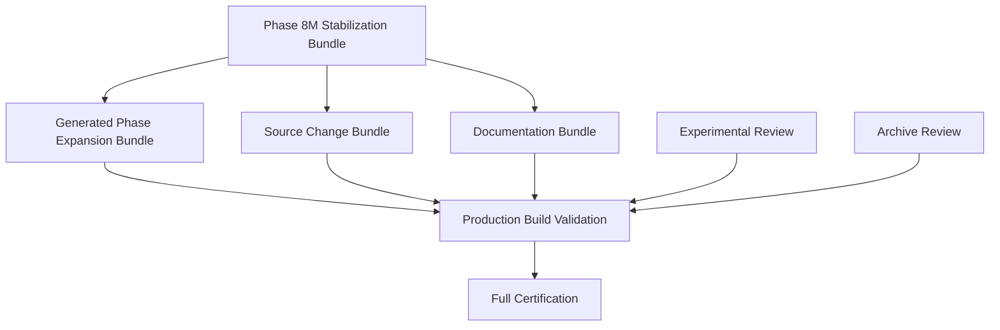

# Phase 8M Repository Reconciliation Plan

Status: active reconciliation roadmap

## Objective

Resolve the dirty worktree into reviewable, evidence-backed bundles without deleting work, weakening architecture, or combining unrelated changes.

## Bundle Dependency Graph



## Execution Timeline

### 1. Phase 8M Stabilization Bundle

Contents:

- Phase 8M reports.
- Phase 8M gate script.
- Verification scripts.
- Recommendation resilience fixture repair.
- Truth Ledger completion lint cleanup.

Exit criteria:

- Bundle reviewed independently.
- TypeScript PASS.
- Lint PASS with documented warnings.
- Targeted 23-test set PASS.
- Phase 8M classifier runs.

Manifest:

- `docs/phase-8m-bundle-a-stabilization-manifest.md`

### 2. Generated Phase Expansion Bundle

Contents:

- Generated APIs.
- Generated services.
- Generated types.
- Generated tests.
- Generated phase docs.
- Generated UI shells.

Exit criteria:

- Owner assigned per domain.
- Generated-code source documented.
- Route-service-type-test alignment verified.
- Domain tests pass.

Manifest:

- `docs/phase-8m-bundle-b-generated-expansion-manifest.md`

### 3. Source Change Bundle

Contents:

- `app/globals.css`
- `app/layout.tsx`
- `next.config.ts`
- non-generated source/service changes classified outside the stabilization bundle.

Exit criteria:

- Production behavior impact reviewed.
- UI/build impact validated.
- Lint/typecheck remain green.

Manifest:

- `docs/phase-8m-bundle-c-source-change-manifest.md`

### 4. Documentation Bundle

Contents:

- Non-Phase-8M docs.
- QCI documents.
- Historical or roadmap documents.

Exit criteria:

- Superseded docs marked.
- Architecture index links current docs.
- Archive candidates separated.

### 5. Experimental Review

Contents:

- Research/prototype work not needed for release.

Exit criteria:

- Promoted, deferred, or archived.
- No experimental work in release boundary.

### 6. Archive Review

Contents:

- Legacy, duplicate, superseded, and temporary materials.

Exit criteria:

- Archive manifest exists.
- No destructive deletion without review.

### 7. Production Build Validation

Commands:

```bash
npm run build
npm run validate:deploy-config
npm run preflight
```

Exit criteria:

- Build succeeds.
- Artifact generation verified.
- Environment checks pass.

### 8. Full Certification

Commands:

```bash
npm run verify:release
npm run verify:full
```

Exit criteria:

- Release gates pass.
- Repository clean or fully reconciled.
- Generated modules governed.
- PASS criteria satisfied.

## Repository Timeline

Near term:

- Review and commit Phase 8M stabilization bundle.
- Export full dirty classification.
- Assign owners to generated domains.

Mid term:

- Split generated expansion by domain.
- Resolve source changes.
- Complete architecture index.
- Prove release validation.

Final:

- Clean worktree.
- Full unit/integration/build gates pass.
- CI and release reproducibility proven.
- Phase 8M certification moves from FAIL to CONDITIONAL_PASS, then PASS.

## Phase 8M.13 Generated Expansion Reconciliation

Generated entries reviewed: 25 Mission Control generated entries.

Generated entries remaining: 825 generated entries remain unreviewed for commit readiness.

Domain selected first: Mission Control.

Validation:

- Mission Control targeted Vitest: PASS, 5 files and 104 tests.
- `npm run typecheck`: PASS.
- `node scripts/phase-8m-quality-gate.cjs --classify`: PASS as script.

Commit readiness: Mission Control is review-ready but not staged. It can become the first generated-domain commit only after explicit staged-diff verification.

Remaining blockers:

- 825 generated entries remain unreconciled.
- 26 source changes remain excluded.
- 9 non-generated documentation entries remain excluded.
- 1 test repair remains excluded.
- 4 Phase 8M leftovers remain excluded.
- Full unit suite and production build are not proven.

Next domain: Autonomy or Delegation, because both are the next-smallest generated domains at 30 entries each.

## Phase 8M.14 Mission Control Generated Domain Commit

Mission Control committed: this commit is intended to integrate Mission Control as the pilot generated-domain baseline.

Validation:

- Mission Control targeted Vitest: PASS, 64 files and 1413 tests.
- TypeScript: PASS.
- Phase 8M classifier: PASS as script.

Remaining generated entries: expected to decrease from 850 to 825 after the Mission Control generated domain commit.

Remaining bundles:

- Governance
- Autonomy
- Replay
- Runtime
- Recommendation
- Truth Ledger
- Recovery
- Planning
- Delegation
- Certification
- Shared Contracts

Certification state: FAIL.

## Phase 8M.27 Bundle C Stage 1

Infrastructure files prepared for commit:

- `app/globals.css`
- `app/layout.tsx`
- `next.config.ts`

Validation summary:

- TypeScript: PASS.
- Lint: PASS with 22 warnings.
- Phase 8M classifier: PASS as script.
- Stage verification: PASS, exactly 3 staged files and 0 unexpected paths.

Repository status: Bundle C has transitioned from planning to implementation.

Remaining Bundle C entries: 11.

Residual generated artifacts remaining: 40.

Certification state: FAIL.

Next implementation stage: choose the smallest bounded follow-up from the Phase 8M.26 dependency sequence.

## Phase 8M.27 Bundle C Stage 1 Post-Commit

Infrastructure files committed: `d656b74 Phase 8M.27: Integrate Bundle C infrastructure source changes (Stage 1)`.

Post-commit classifier:

- Total dirty entries: 71.
- Generated Phase Expansion: 40.
- Phase 8M Stabilization: 10.
- Documentation: 9.
- Source Changes: 11.
- Test Repairs: 1.

Repository status: Bundle C implementation has started with the lowest-risk infrastructure source changes.

Next implementation stage: runtime simulation completion follow-up or recommendation constraint export follow-up.

## Phase 8M.28 Bundle C Stage 2

Runtime/service changes prepared for commit:

- `app/api/v1/runtime/health/route.ts`

Validation summary:

- TypeScript: PASS.
- Lint: PASS with 22 warnings.
- Phase 8M classifier: PASS as script.
- Stage verification: PASS, exactly 1 staged file and 0 unexpected paths.

Repository status: Bundle C Stage 2 is limited to the approved runtime API route because no remaining service source file is classified ready in the Phase 8M.26 source inventory.

Residual generated artifacts: 40.

Certification state: FAIL.

Next repair phase: runtime simulation completion follow-up or recommendation constraint export follow-up.

## Phase 8M.29 Documentation & Stabilization

Documentation committed: pending.

Evidence consolidated: Phase 8M reports and QCI documentation are prepared for a documentation-only stabilization commit.

Test repair status: blocked and deferred.

Remaining generated artifacts: 39.

Remaining blocked source changes: 11.

Certification status: FAIL.

## Phase 8M.30 Final Repository Validation

Final repository state: not certified.

Certification decision: FAIL.

Next repair sequence:

1. Resolve residual generated artifacts.
2. Resolve blocked source changes.
3. Resolve deferred test repair.
4. Fix full unit suite failures/timeouts.
5. Fix production build `EMFILE` failure.
6. Re-run release validation.

Final certification package:

- `docs/phase-8m-final-validation-report.md`
- `docs/phase-8m-final-certification-report.md`
- `docs/phase-8m-release-readiness-report.md`
- `docs/phase-8m-final-blocker-register.md`

Next repair phase: residual generated artifact implementation or blocked source-change follow-up, beginning with the smallest independently validated bundle.

## Phase 8M.29 Documentation & Stabilization Post-Commit

Documentation committed: `fb1bcd8 Phase 8M.29: Consolidate Phase 8M documentation and stabilization evidence`.

Evidence consolidated: YES.

Test repair status: deferred.

Post-commit classifier:

- Total dirty entries: 51.
- Generated Phase Expansion: 39.
- Source Changes: 11.
- Test Repairs: 1.

Repository status: documentation and stabilization evidence are consolidated. Remaining work is implementation-only: residual generated artifact resolution, blocked source-change resolution, and deferred test repair.

Certification status: FAIL.

## Phase 8M.28 Bundle C Stage 2 Post-Commit

Runtime/service changes committed: `7f677c6 Phase 8M.28: Integrate Bundle C runtime and service source changes (Stage 2)`.

Post-commit classifier:

- Total dirty entries: 72.
- Phase 8M Stabilization: 12.
- Generated Phase Expansion: 39.
- Documentation: 9.
- Source Changes: 11.
- Test Repairs: 1.

Repository status: Stage 2 integrated the approved runtime health route only. No service source file was included because the Phase 8M.26 source inventory did not classify any remaining service file as ready.

Next repair phase: runtime simulation completion follow-up or recommendation constraint export follow-up.

Next domain: Autonomy or Delegation.

## Phase 8M.15 Autonomy Generated Domain

Autonomy committed: this commit is intended to integrate Autonomy as the second generated-domain baseline.

Validation summary:

- Autonomy targeted Vitest: PASS, 15 files and 349 tests.
- TypeScript: PASS.
- Phase 8M classifier: PASS as script.

Generated entries remaining: 751 after the Autonomy generated domain commit.

Repository status: generated-domain reconciliation in progress.

Remaining domains:

- Governance
- Replay
- Runtime
- Recommendation
- Truth Ledger
- Recovery
- Planning
- Delegation
- Certification
- Shared Contracts

Certification state: FAIL.

Next recommended domain: Delegation.

## Phase 8M.16 Delegation Generated Domain

Delegation committed: this commit is intended to integrate Delegation as the third generated-domain baseline.

Validation summary:

- Delegation targeted Vitest: PASS, 6 files and 150 tests.
- TypeScript: PASS.
- Phase 8M classifier: PASS as script.

Generated entries remaining: expected to decrease from 751 to 721 after the Delegation generated domain commit.

Repository status: generated-domain reconciliation in progress.

Remaining domains:

- Governance
- Replay
- Runtime
- Recommendation
- Truth Ledger
- Recovery
- Planning
- Certification
- Shared Contracts

Certification state: FAIL.

Recommended next domain: Recovery.

## Phase 8M.17 Recovery Generated Domain

Recovery committed: this commit is intended to integrate Recovery as the fourth generated-domain baseline.

Validation summary:

- Recovery targeted Vitest: PASS, 13 files and 286 tests.
- TypeScript: PASS.
- Phase 8M classifier: PASS as script.

Generated entries remaining: 662 after the Recovery generated domain commit.

Post-commit classifier:

- Total dirty entries: 708.
- Generated Phase Expansion: 662.
- Source Changes: 25.
- Phase 8M Stabilization: 11.
- Documentation: 9.
- Test Repairs: 1.

Repository status: generated-domain reconciliation in progress.

Remaining generated domains:

- Governance
- Replay
- Runtime
- Recommendation
- Truth Ledger
- Planning
- Certification
- Shared Contracts

Certification state: FAIL.

Recommended next generated domain: Replay.

## Phase 8M.24 Certification Generated Domain

Certification prepared: this commit is intended to integrate Certification as the next generated-domain baseline.

Validation summary:

- Requested Certification wildcard Vitest: SKIPPED, no `tests/unit/certification-*` suites discovered.
- Discovered Certification validation Vitest: PASS, 9 files and 152 tests.
- TypeScript: PASS.
- Phase 8M classifier: PASS as script.

Generated entries before commit: 101.

Repository status: generated-domain reconciliation in progress.

Remaining generated domains:

- Shared Contracts

Certification state: FAIL.

Recommended next generated domain: Shared Contracts.

## Phase 8M.24 Post-Commit Reconciliation State

Certification committed: `Phase 8M.24: Commit Certification generated domain`.

Post-commit classifier:

- Total dirty entries: 80.
- Generated Phase Expansion: 55.
- Source Changes: 14.
- Phase 8M Stabilization: 1.
- Documentation: 9.
- Test Repairs: 1.

Remaining generated domain:

- Shared Contracts.

Certification state: FAIL.

Next phase: Phase 8M.25 Shared Contracts Generated Domain Integration.

## Phase 8M.25 Shared Contracts Generated Domain

Shared Contracts prepared: this commit is intended to integrate the final generated-domain contract boundary.

Validation summary:

- Shared Contracts Vitest: PASS, 3 files and 54 tests.
- TypeScript: PASS.
- Phase 8M classifier: PASS as script.

Generated entries before commit: 55.

Repository status: generated-domain reconciliation in progress.

Remaining non-generated work:

- Source changes.
- Documentation reconciliation.
- Phase 8M stabilization cleanup.
- Test repair.

Certification state: FAIL.

Next phase: Phase 8M.26 Bundle C Source Changes Reconciliation.

## Phase 8M.25 Post-Commit Reconciliation State

Shared Contracts committed: `Phase 8M.25: Commit Shared Contracts generated domain`.

Post-commit classifier:

- Total dirty entries: 64.
- Generated Phase Expansion: 40.
- Source Changes: 14.
- Documentation: 9.
- Test Repairs: 1.

Generated-domain reconciliation state:

- Mission Control, Autonomy, Delegation, Recovery, Governance, Replay, Runtime, Recommendation, Truth Ledger, Planning, Certification, and Shared Contracts generated domains have independent baseline commits.
- 40 residual generated entries remain outside the accepted Shared Contracts boundary and require explicit disposition before final certification.

Certification state: FAIL.

Next phase: Phase 8M.26 Bundle C Source Changes Reconciliation, with residual generated artifacts classified before staging source changes.

## Phase 8M.26 Residual Generated Resolution

Residual generated artifacts: 40.

Disposition complete: YES.

Bundle C source inventory: complete.

Dependency analysis: complete.

Repository status: discovery complete; implementation not staged.

Validation status:

- TypeScript: PASS.
- Phase 8M classifier: PASS as script.

Classifier after Phase 8M.26 documentation updates:

- Total dirty entries: 72.
- Generated Phase Expansion: 40.
- Source Changes: 14.
- Phase 8M Stabilization: 8.
- Documentation: 9.
- Test Repairs: 1.

Next implementation sequence:

1. Narrow source stabilization commit for UI/build deterministic changes.
2. Runtime simulation completion follow-up.
3. Recommendation constraint export follow-up.
4. Predictive intelligence residual generated bundle.
5. Governance risk/intelligence residual generated bundle.
6. EdgeBook foundation bundle.
7. Manual review bundle for remaining generated-like services.

Certification state: FAIL.

## Phase 8M.21 Recommendation Generated Domain

Recommendation committed: `Phase 8M.21: Commit Recommendation generated domain`.

Validation summary:

- Recommendation targeted Vitest: PASS by batched validation, including isolated serial validation for timeout-heavy suites.
- TypeScript: PASS.
- Phase 8M classifier: PASS as script.
- Staged-diff guard: PASS.

Generated entries remaining: 238 after the Recommendation generated domain commit.

Post-commit classifier:

- Total dirty entries: 275.
- Generated Phase Expansion: 238.
- Source Changes: 24.
- Phase 8M Stabilization: 3.
- Documentation: 9.
- Test Repairs: 1.

Repository status: generated-domain reconciliation in progress.

Remaining generated domains:

- Truth Ledger
- Planning
- Certification
- Shared Contracts

Certification state: FAIL.

Recommended next generated domain: Truth Ledger.

## Phase 8M.22 Truth Ledger Generated Domain

Truth Ledger status: validated before staging.

Validation summary:

- Truth Ledger targeted Vitest: PASS, 13 files and 331 tests.
- TypeScript: PASS.
- Phase 8M classifier: PASS as script.
- Maintenance inspection: PASS inspect-only.

Generated entries before commit: 238.

Repository status: generated-domain reconciliation in progress.

Remaining generated domains after this phase should include:

- Planning
- Certification
- Shared Contracts

Certification state: FAIL.

Recommended next generated domain after Truth Ledger: Planning or Certification.

### Phase 8M.22 Post-Commit Result

Truth Ledger committed: `Phase 8M.22: Commit Truth Ledger generated domain`.

Post-commit classifier:

- Total dirty entries: 190.
- Generated Phase Expansion: 155.
- Source Changes: 23.
- Phase 8M Stabilization: 2.
- Documentation: 9.
- Test Repairs: 1.

Repository status: generated-domain reconciliation in progress.

Remaining generated domains:

- Planning
- Certification
- Shared Contracts

Certification state: FAIL.

Recommended next generated domain: Planning or Certification.

## Phase 8M.23 Planning Generated Domain

Planning status: validated before staging.

Validation summary:

- Requested `tests/unit/planning-*` Vitest: SKIPPED, no matching dirty Planning suites discovered.
- Discovered Planning/orchestration Vitest: PASS, 13 files and 312 tests.
- TypeScript: PASS.
- Phase 8M classifier: PASS as script.

Generated entries before commit: 155.

Repository status: generated-domain reconciliation in progress.

Remaining generated domains after this phase should include:

- Certification
- Shared Contracts

Certification state: FAIL.

Recommended next generated domain after Planning: Certification.

### Phase 8M.23 Post-Commit Result

Planning committed: `Phase 8M.23: Commit Planning generated domain`.

Post-commit classifier:

- Total dirty entries: 129.
- Generated Phase Expansion: 101.
- Source Changes: 16.
- Phase 8M Stabilization: 2.
- Documentation: 9.
- Test Repairs: 1.

Repository status: generated-domain reconciliation in progress.

Remaining generated domains:

- Certification
- Shared Contracts

Certification state: FAIL.

Recommended next generated domain: Certification.

## Phase 8M.20 Runtime Generated Domain

Runtime committed: this commit is intended to integrate Runtime as the seventh generated-domain baseline.

Validation summary:

- Runtime targeted Vitest: PASS, 14 files and 338 tests.
- TypeScript: PASS.
- Phase 8M classifier: PASS as script.

Generated entries remaining: 326 after the Runtime generated domain commit.

Post-commit classifier:

- Total dirty entries: 368.
- Generated Phase Expansion: 326.
- Source Changes: 24.
- Phase 8M Stabilization: 8.
- Documentation: 9.
- Test Repairs: 1.

Repository status: generated-domain reconciliation in progress.

Remaining generated domains:

- Recommendation
- Truth Ledger
- Planning
- Certification
- Shared Contracts

Certification state: FAIL.

Recommended next generated domain: Recommendation.

## Phase 8M.21 Recommendation Generated Domain

Recommendation committed: this commit is intended to integrate Recommendation as the eighth generated-domain baseline.

Validation summary:

- Recommendation targeted Vitest: PASS by batched validation across all discovered Recommendation families.
- Timeout-heavy Recommendation subset: PASS, 37 files and 273 tests.
- TypeScript: PASS.
- Phase 8M classifier: PASS as script.

Generated entries remaining: expected to decrease from 326 after the Recommendation generated domain commit.

Repository status: generated-domain reconciliation in progress.

Remaining generated domains:

- Truth Ledger
- Planning
- Certification
- Shared Contracts

Certification state: FAIL.

Recommended next generated domain: Truth Ledger.

## Phase 8M.19 Replay Generated Domain

Replay committed: this commit is intended to integrate Replay as the sixth generated-domain baseline.

Validation summary:

- Replay targeted Vitest: PASS, 6 files and 143 tests.
- TypeScript: PASS.
- Phase 8M classifier: PASS as script.

Generated entries remaining: 395 after the Replay generated domain commit.

Post-commit classifier:

- Total dirty entries: 439.
- Generated Phase Expansion: 395.
- Source Changes: 25.
- Phase 8M Stabilization: 9.
- Documentation: 9.
- Test Repairs: 1.

Repository status: generated-domain reconciliation in progress.

Remaining generated domains:

- Runtime
- Recommendation
- Truth Ledger
- Planning
- Certification
- Shared Contracts

Certification state: FAIL.

Recommended next generated domain: Runtime.

## Phase 8M.18 Governance Generated Domain

Governance committed: this commit is intended to integrate Governance as the fifth generated-domain baseline.

Validation summary:

- Governance targeted Vitest: PASS by batched validation, 48 files and 896 tests covered.
- TypeScript: PASS.
- Phase 8M classifier: PASS as script.

Generated entries remaining: 434 after the Governance generated domain commit.

Post-commit classifier:

- Total dirty entries: 479.
- Generated Phase Expansion: 434.
- Source Changes: 25.
- Phase 8M Stabilization: 10.
- Documentation: 9.
- Test Repairs: 1.

Repository status: generated-domain reconciliation in progress.

Remaining generated domains:

- Replay
- Runtime
- Recommendation
- Truth Ledger
- Planning
- Certification
- Shared Contracts

Certification state: FAIL.

Recommended next generated domain: Replay.
