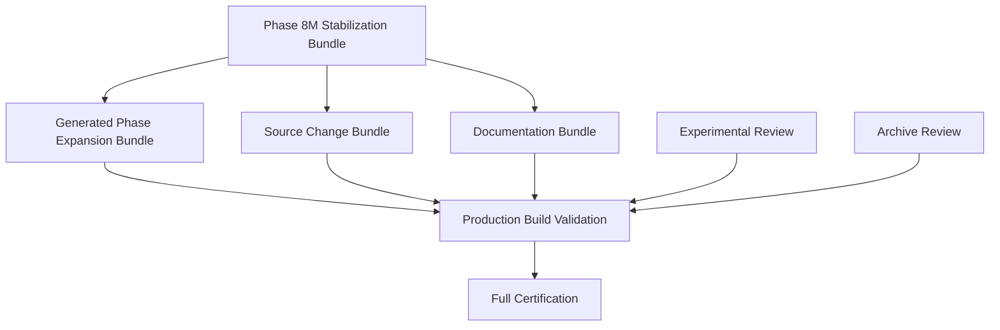

# Phase 8M Repository Reconciliation Plan

Status: active reconciliation roadmap

## Objective

Resolve the dirty worktree into reviewable, evidence-backed bundles without deleting work, weakening architecture, or combining unrelated changes.

## Bundle Dependency Graph



## Execution Timeline

### 1. Phase 8M Stabilization Bundle

Contents:

- Phase 8M reports.
- Phase 8M gate script.
- Verification scripts.
- Recommendation resilience fixture repair.
- Truth Ledger completion lint cleanup.

Exit criteria:

- Bundle reviewed independently.
- TypeScript PASS.
- Lint PASS with documented warnings.
- Targeted 23-test set PASS.
- Phase 8M classifier runs.

Manifest:

- `docs/phase-8m-bundle-a-stabilization-manifest.md`

### 2. Generated Phase Expansion Bundle

Contents:

- Generated APIs.
- Generated services.
- Generated types.
- Generated tests.
- Generated phase docs.
- Generated UI shells.

Exit criteria:

- Owner assigned per domain.
- Generated-code source documented.
- Route-service-type-test alignment verified.
- Domain tests pass.

Manifest:

- `docs/phase-8m-bundle-b-generated-expansion-manifest.md`

### 3. Source Change Bundle

Contents:

- `app/globals.css`
- `app/layout.tsx`
- `next.config.ts`
- non-generated source/service changes classified outside the stabilization bundle.

Exit criteria:

- Production behavior impact reviewed.
- UI/build impact validated.
- Lint/typecheck remain green.

Manifest:

- `docs/phase-8m-bundle-c-source-change-manifest.md`

### 4. Documentation Bundle

Contents:

- Non-Phase-8M docs.
- QCI documents.
- Historical or roadmap documents.

Exit criteria:

- Superseded docs marked.
- Architecture index links current docs.
- Archive candidates separated.

### 5. Experimental Review

Contents:

- Research/prototype work not needed for release.

Exit criteria:

- Promoted, deferred, or archived.
- No experimental work in release boundary.

### 6. Archive Review

Contents:

- Legacy, duplicate, superseded, and temporary materials.

Exit criteria:

- Archive manifest exists.
- No destructive deletion without review.

### 7. Production Build Validation

Commands:

```bash
npm run build
npm run validate:deploy-config
npm run preflight
```

Exit criteria:

- Build succeeds.
- Artifact generation verified.
- Environment checks pass.

### 8. Full Certification

Commands:

```bash
npm run verify:release
npm run verify:full
```

Exit criteria:

- Release gates pass.
- Repository clean or fully reconciled.
- Generated modules governed.
- PASS criteria satisfied.

## Repository Timeline

Near term:

- Review and commit Phase 8M stabilization bundle.
- Export full dirty classification.
- Assign owners to generated domains.

Mid term:

- Split generated expansion by domain.
- Resolve source changes.
- Complete architecture index.
- Prove release validation.

Final:

- Clean worktree.
- Full unit/integration/build gates pass.
- CI and release reproducibility proven.
- Phase 8M certification moves from FAIL to CONDITIONAL_PASS, then PASS.

## Phase 8M.13 Generated Expansion Reconciliation

Generated entries reviewed: 25 Mission Control generated entries.

Generated entries remaining: 825 generated entries remain unreviewed for commit readiness.

Domain selected first: Mission Control.

Validation:

- Mission Control targeted Vitest: PASS, 5 files and 104 tests.
- `npm run typecheck`: PASS.
- `node scripts/phase-8m-quality-gate.cjs --classify`: PASS as script.

Commit readiness: Mission Control is review-ready but not staged. It can become the first generated-domain commit only after explicit staged-diff verification.

Remaining blockers:

- 825 generated entries remain unreconciled.
- 26 source changes remain excluded.
- 9 non-generated documentation entries remain excluded.
- 1 test repair remains excluded.
- 4 Phase 8M leftovers remain excluded.
- Full unit suite and production build are not proven.

Next domain: Autonomy or Delegation, because both are the next-smallest generated domains at 30 entries each.

## Phase 8M.14 Mission Control Generated Domain Commit

Mission Control committed: this commit is intended to integrate Mission Control as the pilot generated-domain baseline.

Validation:

- Mission Control targeted Vitest: PASS, 64 files and 1413 tests.
- TypeScript: PASS.
- Phase 8M classifier: PASS as script.

Remaining generated entries: expected to decrease from 850 to 825 after the Mission Control generated domain commit.

Remaining bundles:

- Governance
- Autonomy
- Replay
- Runtime
- Recommendation
- Truth Ledger
- Recovery
- Planning
- Delegation
- Certification
- Shared Contracts

Certification state: FAIL.

Next domain: Autonomy or Delegation.
